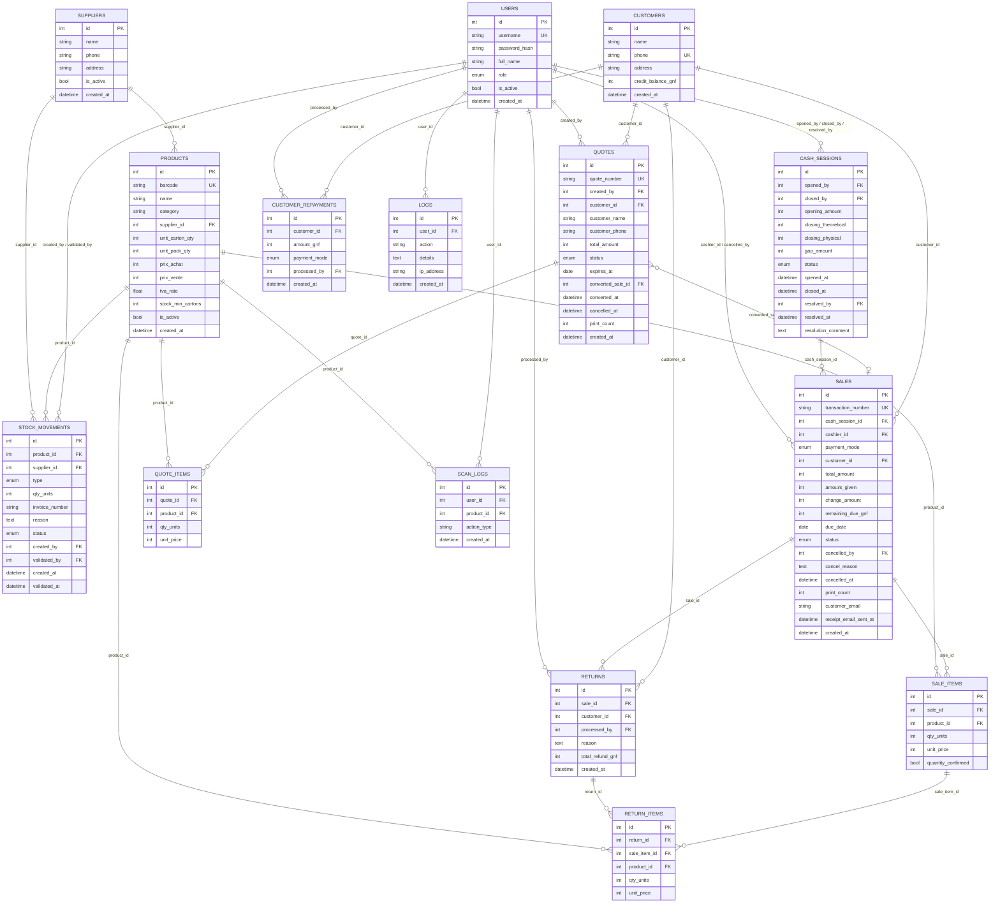

# Diagramme de données — La Cave du Coin

Généré à partir de [`app/models.py`](app/models.py). Le schéma réel de la base
est géré par Alembic (`migrations/`) — ce fichier est purement documentaire.

**Comment le voir en diagramme** :
- **GitHub** : ce bloc Mermaid se rend automatiquement en diagramme quand tu
  ouvres ce fichier sur github.com (aucune action nécessaire).
- **VS Code** : installer l'extension "Markdown Preview Mermaid Support",
  puis ouvrir l'aperçu Markdown (`Ctrl+Shift+V`).
- **N'importe où** : coller le contenu du bloc ci-dessous sur
  [mermaid.live](https://mermaid.live).

## Notes de lecture

- **Champs `enum`** : `role` (users), `payment_mode` (sales, customer_repayments),
  `type`/`status` (stock_movements), `status` (cash_sessions, sales, quotes) —
  voir les classes `enum.Enum` correspondantes dans `app/models.py` pour les
  valeurs possibles.
- **Stock courant d'un produit** : non stocké directement, **dérivé** des
  `stock_movements` validés (`app/services/products.py::get_current_stock_units`).
- **`quotes.converted_sale_id`** : lien optionnel devis → vente. C'est
  volontairement le devis qui référence la vente (et non l'inverse), pour que
  `sales`/`sale_items` restent inchangés par la fonctionnalité devis.
- Plusieurs tables ont **plusieurs clés étrangères vers `users`** avec des
  rôles différents (ex: `stock_movements.created_by` vs `validated_by`,
  `sales.cashier_id` vs `cancelled_by`) — représentées ici par une seule
  flèche groupée par lisibilité, mais ce sont bien des colonnes distinctes.
